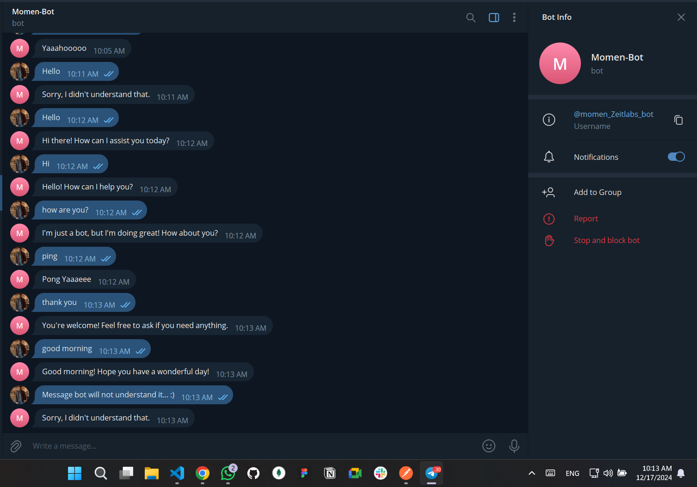

# Telegram Bot using Next.js

This project is a Telegram bot built with Next.js. It allows you to interact with users on Telegram and provide various functionalities.



## Features

- Easy to set up and deploy
- Built with Next.js for server-side rendering
- Supports multiple commands and interactions
- Scalable and maintainable codebase

## Installation

1. Clone the repository:

```bash
git clone https://github.com/yourusername/telegram_bot.git
```

2. Navigate to the project directory:

```bash
cd telegram_bot
```

3. Install the dependencies:

```bash
npm install
```

## Usage

1. Create a `.env` file in the root directory and add your Telegram bot token:

```env
BOT_TOKEN=your_bot_token_here
```

2. Start the development server:

```bash
npm run dev
```

3. Open your browser and go to `http://localhost:3000` to see the bot in action.

## Deployment

To deploy the bot, you can use platforms like Vercel or Heroku. Make sure to set the environment variables on the deployment platform.

## Contributing

Contributions are welcome! Please open an issue or submit a pull request.

## License

This project is licensed under the MIT License.
